# Social Media Post Generation for Advertisement

A comprehensive AI-powered system for generating research-backed social media content using agentic AI workflows. The system leverages multiple specialized agents to conduct research, analyze competitors, and generate engaging posts optimized for LinkedIn and Twitter/X platforms.

---

# Project Overview

This project implements a multi-agent system that automates content creation for social media marketing. It combines web search capabilities, deep research analysis, competitor intelligence gathering, and AI-driven content generation to produce high-quality, engagement-optimized social media posts.

## Key Features

- Multi-agent architecture with specialized roles:
  - Web Search Agent
  - Deep Research Agent
  - Competitor Analysis Agent
  - Content Writer Agent
- Integration with Groq LLM for fast inference
- Real-time web search and website scraping capabilities
- Competitor content analysis and strategy insights
- Character-aware tweet generation for:
  - Free Twitter/X accounts (1000 characters)
  - Paid Twitter/X accounts (4000 characters)
- Thread and individual tweet generation modes
- REST API backend using Flask
- Streamlit-based interactive web interface
- Pydantic models for structured data validation

---

# Architecture

## System Components

### 1. Backend API (Flask)

Features:
- RESTful endpoints for content generation
- CORS support for cross-origin requests
- Request validation and error handling

File:
```bash
twitter_content_app.py
````

---

### 2. Frontend Interface (HTML/JavaScript)

Features:

* Single Page Application (SPA) interface
* Real-time form validation
* Loading states and response handling
* Copy-to-clipboard functionality

File:

```bash
index.html
```

---

### 3. Streamlit Application

Features:

* Full-featured UI for advanced configuration
* API key management
* Feature toggles:

  * Deep Research
  * Competitor Analysis
  * Smart Hashtags
* Multi-step workflow visualization
* Download functionality

---

# Agent System

The system uses four specialized AI agents working together in a coordinated workflow.

---

## 1. Web Search Agent

Responsibilities:

* Searches current information on given topics
* Identifies trending discussions and recent news
* Extracts key talking points and content angles

Tools Used:

* DuckDuckGoTools

---

## 2. Deep Research Agent

Responsibilities:

* Conducts comprehensive topic analysis
* Cross-references multiple sources
* Synthesizes findings with reasoning
* Identifies unique insights and statistics

Tools Used:

* DuckDuckGoTools
* ReasoningTools (optional)

---

## 3. Competitor Analysis Agent

Responsibilities:

* Analyzes competitor social media strategies
* Identifies hashtag usage patterns
* Studies engagement trends and content themes
* Scrapes competitor websites for intelligence

Tools Used:

* DuckDuckGoTools
* FirecrawlTools (optional)

---

## 4. Content Writer Agent

Responsibilities:

* Generates engaging research-backed content
* Creates platform-optimized hashtags
* Ensures character limit compliance
* Adds hooks, CTAs, and engagement prompts
* Matches writing tone to the target topic

---

# Technical Stack

## Dependencies

| Technology | Purpose                      |
| ---------- | ---------------------------- |
| agno       | Agentic AI framework         |
| groq       | LLM API integration          |
| flask      | REST API framework           |
| flask-cors | CORS support                 |
| streamlit  | Web application UI           |
| fastapi    | Optional async API framework |
| uvicorn    | ASGI server                  |
| requests   | HTTP requests                |
| pydantic   | Data validation              |

---

# External APIs

* Groq API
* DuckDuckGo Search
* Firecrawl API
* Agno Framework

---

# Data Models

## Tweet Model

```python
class Tweet(BaseModel):
    content: str
    character_count: int
    hashtags: List[str]
```

---

## TweetOutput Model

```python
class TweetOutput(BaseModel):
    tweets: List[Tweet]
    is_thread: bool
    topic_summary: str
```

---

## CompetitorInsight Model

```python
class CompetitorInsight(BaseModel):
    competitor_name: str
    content_strategy: str
    hashtag_patterns: List[str]
    posting_frequency: str
    key_themes: List[str]
```

---

# Installation

## Prerequisites

* Python 3.8+
* Groq API key
* Firecrawl API key (optional)

---

## Setup Instructions

### 1. Clone Repository

```bash
git clone https://github.com/Devyani1205/Social-Media-Post-Generation-for-Advertisement.git

cd Social-Media-Post-Generation-for-Advertisement
```

---

### 2. Create Virtual Environment

```bash
python -m venv venv
```

Activate environment:

#### Linux/macOS

```bash
source venv/bin/activate
```

#### Windows

```bash
venv\Scripts\activate
```

---

### 3. Install Dependencies

```bash
pip install -r requirements.txt
```

---

### 4. Configure Environment Variables

#### Linux/macOS

```bash
export GROQ_API_KEY="your_groq_api_key"

export FIRECRAWL_API_KEY="your_firecrawl_api_key"
```

#### Windows

```bash
set GROQ_API_KEY=your_groq_api_key

set FIRECRAWL_API_KEY=your_firecrawl_api_key
```

---

# Usage

## Option 1: Flask REST API

### Start Backend

```bash
python twitter_content_app.py
```

### API Endpoint

```http
POST http://localhost:5000/api/generate
```

### Example Request

```json
{
  "brand_name": "MindNXT",
  "website_summary": "AI-powered learning platform",
  "tone": "Professional",
  "goal": "Increase Engagement"
}
```

---

## Option 2: Streamlit Application

### Launch Streamlit

```bash
streamlit run twitter_content_app.py
```

Access:

```text
http://localhost:8501
```

### Configuration Options

* API key management
* Account type selection
* Tweet count selection
* Thread or individual tweet generation
* Research depth toggles
* Competitor analysis toggles

---

## Option 3: Web Interface

Open:

```bash
index.html
```

in a web browser and connect it to the Flask backend.

---
# Comprehensive detailed workflow flowchart for Social Media Post Generation application:

```mermaid
graph TD
    A["🎯 START: User Input Interface<br/>(Web Form/Streamlit UI)"]
    
    A -->|Input Fields| B["📝 STEP 1: Data Collection"]
    
    B --> B1["Brand Name"]
    B --> B2["Website URL<br/>Optional"]
    B --> B3["Topic/Content Description"]
    B --> B4["Industry Selection"]
    
    B1 --> C["🔌 STEP 2: Configuration Selection"]
    B2 --> C
    B3 --> C
    B4 --> C
    
    C --> C1["SELECT Platform"]
    C1 --> C1a["LinkedIn<br/>3000 chars<br/>3-5 hashtags"]
    C1 --> C1b["Twitter/X<br/>280-4000 chars<br/>3-5 hashtags"]
    C1 --> C1c["Instagram<br/>2200 chars<br/>5-30 hashtags"]
    
    C --> C2["SELECT Features"]
    C2 --> C2a["✓ Deep Research"]
    C2 --> C2b["✓ Competitor Analysis"]
    C2 --> C2c["✓ Smart Hashtags"]
    C2 --> C2d["✓ Image Suggestions"]
    
    C --> C3["SELECT Output Options"]
    C3 --> C3a["Number of Posts<br/>1-10"]
    C3 --> C3b["Brand Tone<br/>Professional/Friendly/Bold"]
    C3 --> C3c["Primary Goal<br/>Engagement/Leads"]
    
    C1a --> D["🚀 STEP 3: Process Initialization<br/>API Key Validation"]
    C1b --> D
    C1c --> D
    
    D --> E{"Process Workflow<br/>Selection"}
    
    E -->|Deep Research: Yes| F["🔍 STEP 4A: Web Search<br/>Agent Action"]
    E -->|Deep Research: No| G["SKIP"]
    
    F --> F1["Tavily Tools"]
    F1 --> F2["Search Current Information"]
    F1 --> F3["Find Trending Discussions"]
    F1 --> F4["Extract Key Talking Points"]
    F1 --> F5["Industry-Specific Insights"]
    
    F2 --> F6["✅ Web Search Results<br/>Stored in Memory"]
    F3 --> F6
    F4 --> F6
    F5 --> F6
    
    G --> H["🧠 STEP 5A: Deep Research<br/>Agent Action"]
    F6 --> H
    
    H --> H1["Thorough Analysis"]
    H1 --> H2["Cross-Reference Sources"]
    H1 --> H3["Extract Statistics & Facts"]
    H1 --> H4["Identify Unique Angles"]
    
    H2 --> H5["Sentiment Analysis<br/>TextBlob Integration"]
    H3 --> H5
    H4 --> H5
    
    H5 --> H6["✅ Deep Research Output<br/>Key Insights & Data"]
    
    H6 --> I{"Competitor Analysis:<br/>Enabled?"}
    
    I -->|Yes| J["📊 STEP 6: Competitor Analysis<br/>Agent Action"]
    I -->|No| K["SKIP"]
    
    J --> J1["Firecrawl Tools"]
    J1 --> J2["Scrape Competitor Sites"]
    J1 --> J3["Analyze Social Accounts"]
    J1 --> J4["Extract Hashtag Patterns"]
    J1 --> J5["Note Engagement Metrics"]
    
    J2 --> J6["✅ Competitor Intelligence<br/>Content Strategy Mapped"]
    J3 --> J6
    J4 --> J6
    J5 --> J6
    
    K --> L["🧠 STEP 7: Context Retrieval<br/>Pinecone RAG Integration"]
    J6 --> L
    
    L --> L1["Semantic Similarity Search"]
    L1 --> L2["Historical Context Ranking"]
    L1 --> L3["Load Memory Context"]
    
    L2 --> M["💾 STEP 8: Memory Management<br/>LangChain Integration"]
    L3 --> M
    
    M --> M1["Conversation Summary Buffer"]
    M1 --> M2["Token-Aware Summarization"]
    M1 --> M3["Maintain Context Window"]
    
    M2 --> N["✒️ STEP 9: Prompt Engineering<br/>& Template Injection"]
    M3 --> N
    
    N --> N1["Emotion-Aware Prompt"]
    N1 --> N2["Platform-Specific Format"]
    N1 --> N3["Brand Voice Integration"]
    N1 --> N4["Tone Preservation"]
    
    N2 --> O["🤖 STEP 10: LLM Processing<br/>Gemini/GPT-4/Groq"]
    N3 --> O
    N4 --> O
    
    O --> O1["Content Generation"]
    O1 --> O2["Sentence Suggestions"]
    O1 --> O3["Emotional Tone Matching"]
    O1 --> O4["Character Count Validation"]
    
    O2 --> P["✅ Generated Content<br/>Per Post"]
    O3 --> P
    O4 --> P
    
    P --> Q{"Generate Images:<br/>Enabled?"}
    
    Q -->|Yes| R["🖼️ STEP 11: Image Processing"]
    Q -->|No| S["SKIP"]
    
    R --> R1["Unsplash Stock Photos API"]
    R1 --> R2["Search Photos by Topic"]
    R1 --> R3["Filter by Orientation/Size"]
    R1 --> R4["Get Photographer Credits"]
    
    R2 --> R5["AI Image Generation<br/>NanoBanana Optional"]
    R3 --> R5
    R4 --> R5
    
    R5 --> R6["✅ Image Suggestions<br/>URLs & Descriptions"]
    
    S --> T["📋 STEP 12: Output Assembly"]
    R6 --> T
    
    T --> T1["Format Posts with Hashtags"]
    T1 --> T2["Add Character Counts"]
    T1 --> T3["Include Image References"]
    T1 --> T4["Confidence Scores"]
    
    T2 --> U["✅ STEP 13: Response Output"]
    T3 --> U
    T4 --> U
    
    U --> U1["Display Generated Posts"]
    U1 --> U2["Research Summary Section"]
    U1 --> U3["Competitor Analysis Section"]
    U1 --> U4["Image Suggestions Gallery"]
    
    U2 --> V["📤 STEP 14: User Actions"]
    U3 --> V
    U4 --> V
    
    V --> V1["📋 Copy to Clipboard"]
    V --> V2["⬇️ Download as Markdown"]
    V --> V3["📤 Export to Social Platform"]
    V --> V4["🔄 Regenerate Posts"]
    
    V1 --> W["✅ END: Post Ready<br/>for Publishing"]
    V2 --> W
    V3 --> W
    V4 --> W
    
    style A fill:#667eea,color:#fff,stroke:#000,stroke-width:3px
    style W fill:#667eea,color:#fff,stroke:#000,stroke-width:3px
    style D fill:#764ba2,color:#fff,stroke:#000,stroke-width:2px
    style F fill:#f97316,color:#fff,stroke:#000,stroke-width:2px
    style H fill:#f97316,color:#fff,stroke:#000,stroke-width:2px
    style J fill:#f97316,color:#fff,stroke:#000,stroke-width:2px
    style O fill:#8b5cf6,color:#fff,stroke:#000,stroke-width:2px
    style P fill:#10b981,color:#fff,stroke:#000,stroke-width:2px
    style U fill:#10b981,color:#fff,stroke:#000,stroke-width:2px
```




---

## 📊 **DETAILED WORKFLOW BREAKDOWN**

### **Phase 1: Input & Configuration** 
```
┌─────────────────────────────────────────────┐
│  USER INPUTS                                │
├─────────────────────────────────────────────┤
│ • Brand Name                                │
│ • Website URL (Optional)                    │
│ • Topic/Content Description                 │
│ • Industry (Tech, Healthcare, etc.)         │
│ • Platform Choice                           │
│ • Brand Tone                                │
│ • Primary Goal                              │
│ • Number of Posts (1-10)                    │
│ • Features Toggle                           │
└─────────────────────────────────────────────┘
         ▼
┌─────────────────────────────────────────────┐
│  PLATFORM SELECTION                         │
├─────────────────────────────────────────────┤
│ ┌────────────┐  ┌────────────┐  ┌────────┐ │
│ │  LinkedIn  │  │  Twitter   │  │Instagram│ │
│ │ 3000 chars │  │280-4000 chr│ │2200 chr │ │
│ │3-5 hashtags│  │3-5 hashtags│ │5-30 tags│ │
│ └────────────┘  └────────────┘  └────────┘ │
└─────────────────────────────────────────────┘
```

### **Phase 2: Research & Analysis** 
```
┌─────────────────────────────────────────────────────┐
│  MULTI-AGENT RESEARCH PIPELINE                      │
├─────────────────────────────────────────────────────┤
│                                                     │
│  🔍 Agent 1: Web Search Agent                       │
│  ├─ Tool: Tavily API                                │
│  ├─ Action: Search trending topics                  │
│  └─ Output: Current information + links             │
│                                                     │
│  🧠 Agent 2: Deep Research Agent                    │
│  ├─ Tool: Tavily API (Advanced Search)              │
│  ├─ Action: Analyze & synthesize findings           │
│  ├─ Analysis: TextBlob Sentiment Analysis           │
│  └─ Output: Key facts, statistics, insights         │
│                                                     │
│  📊 Agent 3: Competitor Analysis Agent              │
│  ├─ Tool: Firecrawl (Web Scraping)                  │
│  ├─ Action: Scrape competitor strategies            │
│  ├─ Extraction: Hashtags, content themes            │
│  └─ Output: Competitive intelligence                │
│                                                     │
└─────────────────────────────────────────────────────┘
```

### **Phase 3: Content Generation Pipeline**
```
┌────────────────────────────────────────────────┐
│  MEMORY MANAGEMENT (LangChain)                 │
├────────────────────────────────────────────────┤
│ • Conversation Summary Buffer                 │
│ • Token-Aware Summarization                   │
│ • Context Window Management                   │
└────────────┬──────────────────────────────────┘
             ▼
┌────────────────────────────────────────────────┐
│  CONTEXT RETRIEVAL (Pinecone RAG)              │
├────────────────────────────────────────────────┤
│ • Semantic Similarity Search                  │
│ • Historical Context Ranking                  │
│ • Previous Insights Loading                   │
└────────────┬──────────────────────────────────┘
             ▼
┌────────────────────────────────────────────────┐
│  PROMPT ENGINEERING & TEMPLATING               │
├────────────────────────────────────────────────┤
│ • Emotion-Aware Prompt Injection               │
│ • Platform-Specific Format Adjustment          │
│ • Brand Voice Integration                      │
│ • Context-Aware Few-Shot Examples              │
└────────────┬──────────────────────────────────┘
             ▼
┌────────────────────────────────────────────────┐
│  LLM PROCESSING (Gemini/GPT-4/Groq)            │
├────────────────────────────────────────────────┤
│ ✓ Generate content options                    │
│ ✓ Validate character limits                   │
│ ✓ Preserve emotional tone                     │
│ ✓ Create smart hashtags                       │
│ ✓ Ensure platform compliance                  │
└────────────┬──────────────────────────────────┘
             ▼
┌────────────────────────────────────────────────┐
│  SENTIMENT ANALYSIS (TextBlob)                 │
├────────────────────────────────────────────────┤
│ • Polarity Detection (-1 to +1)                │
│ • Subjectivity Analysis (0 to 1)               │
│ • Tone Adjustment & Preservation               │
└────────────────────────────────────────────────┘
```

### **Phase 4: Image & Visual Processing**
```
┌─────────────────────────────────────────┐
│  IMAGE GENERATION PIPELINE              │
├─────────────────────────────────────────┤
│                                         │
│  Option 1: Stock Photo Search           │
│  └─ Unsplash API                        │
│     ├─ Search by keyword                │
│     ├─ Filter orientation               │
│     └─ Get photographer info            │
│                                         │
│  Option 2: AI Image Generation          │
│  └─ NanoBanana/Custom AI                │
│     ├─ Generate custom visuals          │
│     └─ Match topic requirements         │
│                                         │
│  Output: Image URLs + Descriptions      │
│                                         │
└─────────────────────────────────────────┘
```

### **Phase 5: Output & User Actions**
```
┌──────────────────────────────────────────┐
│  GENERATED CONTENT OUTPUT                │
├──────────────────────────────────────────┤
│                                          │
│  📱 Posts Section                        │
│  ├─ Post Content                         │
│  ├─ Hashtags (#tag1 #tag2 ...)           │
│  ├─ Character Count                      │
│  ├─ Confidence Score                     │
│  └─ Image Suggestions                    │
│                                          │
│  📚 Research Summary Section              │
│  ├─ Key Facts & Statistics               │
│  ├─ Trending Angles                      │
│  └─ Industry Insights                    │
│                                          │
│  📊 Competitor Insights Section           │
│  ├─ Content Strategy Analysis             │
│  ├─ Hashtag Patterns                     │
│  └─ Engagement Patterns                  │
│                                          │
│  🖼️ Image Gallery                        │
│  ├─ Stock Photo Options                  │
│  ├─ AI Generated Images                  │
│  └─ Download Links                       │
│                                          │
└──────────────────────────────────────────┘
         ▼
┌──────────────────────────────────────────┐
│  USER ACTION OPTIONS                     │
├──────────────────────────────────────────┤
│ 1️⃣  📋 Copy to Clipboard                  │
│ 2️⃣  ⬇️ Download as Markdown/PDF           │
│ 3️⃣  📤 Share to Platform Directly         │
│ 4️⃣  🔄 Regenerate/Refine Posts            │
│ 5️⃣  💾 Save Draft                         │
│ 6️⃣  📊 View Analytics                     │
└──────────────────────────────────────────┘
```

---

## **🎯 KEY COMPONENTS & THEIR ROLES**

| Component | Function | Input | Output |
|-----------|----------|-------|--------|
| **Web Search Agent** | Gather current information | Topic + Industry | Web search results |
| **Deep Research Agent** | Analyze & synthesize data | Search results | Key facts & insights |
| **Competitor Agent** | Analyze competitor strategies | URLs + Topic | Competitive intelligence |
| **Content Writer Agent** | Generate posts | Research + Brand info | Posts with hashtags |
| **Image Agent** | Find/generate visuals | Topic + Industry | Image URLs & descriptions |
| **Sentiment Analyzer** | Ensure tone consistency | Generated content | Polarity & subjectivity scores |
| **Memory Manager** | Track conversation context | All interactions | Compressed context |
| **Prompt Engineer** | Optimize LLM instructions | User inputs + context | Optimized prompts |

---

This comprehensive flowchart shows the **complete user journey** from input to output with all internal processing steps clearly marked with **bold arrow directions**! 🎯


# Configuration Parameters

## Content Generation Settings

| Parameter          | Value           |
| ------------------ | --------------- |
| Free Account Limit | 1000 characters |
| Paid Account Limit | 4000 characters |
| Recommended Usage  | 70% of limit    |
| Hashtags per Tweet | 3–5             |
| Number of Tweets   | 1–10            |

---

## Agent Settings

| Parameter   | Value                                     |
| ----------- | ----------------------------------------- |
| Model       | meta-llama/llama-4-scout-17b-16e-instruct |
| Provider    | Groq                                      |
| Temperature | Model Default                             |

---

## Research Options

### Deep Research

Enables:

* Cross-referencing
* Step-by-step reasoning
* Enhanced synthesis

### Competitor Analysis

Enables:

* Competitor intelligence gathering
* Strategy comparison
* Hashtag analysis

### Smart Hashtags

Enables:

* Context-aware hashtag generation
* Trend-focused optimization

---

# API Response Format

## Success Response

```json
{
  "success": true,
  "content": "Generated tweet content with hashtags and metadata"
}
```

---

## Error Response

```json
{
  "success": false,
  "error": "Error description"
}
```

---

# File Structure

```bash
.
├── twitter_content_app.py
├── index.html
├── requirements.txt
├── README.md
└── twitter_content_report.pdf
```

---

# Performance Considerations

| Operation           | Estimated Time |
| ------------------- | -------------- |
| Web Search          | 2–5 seconds    |
| Deep Research       | 5–15 seconds   |
| Competitor Analysis | 3–8 seconds    |
| Content Generation  | 1–3 seconds    |
| Total Request       | 10–30 seconds  |

---

# Error Handling

The system includes:

* API key validation
* Input validation using Pydantic
* Network error handling
* Graceful fallback mechanisms
* User-friendly error messages

---

# Limitations

## Current Limitations

* Single LLM model support
* Synchronous processing only
* Limited caching
* No authentication layer

---

# Future Enhancements

Potential upgrades include:

* Async task queues (Celery/RQ)
* Multi-model support
* Redis caching
* Database persistence
* User authentication
* Batch processing
* Historical content tracking
* Analytics dashboard

---

# Dependencies Details

```txt
agno
groq
flask==3.0.0
flask-cors==4.0.0
fastapi
uvicorn
streamlit
requests
pydantic
```

---

# Environment Variables

## Required

```bash
GROQ_API_KEY
```

## Optional

```bash
FIRECRAWL_API_KEY
```

---

# Testing

## Test Using cURL

```bash
curl -X POST http://localhost:5000/api/generate \
  -H "Content-Type: application/json" \
  -d '{
        "brand_name":"TestBrand",
        "website_summary":"Test service",
        "tone":"Professional",
        "goal":"Increase Engagement"
      }'
```

---

# Security Considerations

* API keys stored securely in environment variables
* Input sanitization using Pydantic
* CORS configuration enabled
* No sensitive data logging
* Rate limiting recommended for production

---

# Contributing

Contributions are welcome.

Please ensure:

* Code follows existing structure
* Error handling is implemented properly
* Dependencies are updated in requirements.txt
* API compatibility is maintained

---

# License

Add your preferred project license here.

Example:

```text
MIT License
```

---

# Documentation & Resources

* Agno Framework: [https://agno.com](https://agno.com)
* Groq API: [https://groq.com](https://groq.com)
* Flask Documentation: [https://flask.palletsprojects.com](https://flask.palletsprojects.com)
* Streamlit Documentation: [https://streamlit.io](https://streamlit.io)

---

# Troubleshooting

## Backend Connection Error

Ensure Flask backend is running:

```bash
python twitter_content_app.py
```

Default backend:

```text
http://localhost:5000
```

---

## API Key Errors

Verify:

```bash
GROQ_API_KEY
```

is correctly configured in environment variables.

---

## Slow Processing

Suggestions:

* Check internet connectivity
* Disable Deep Research
* Reduce number of tweets generated

---

## Character Limit Issues

Recommendations:

* Keep website summary concise
* Use shorter prompts
* Choose appropriate account type

---

```
```
